<!-- AUTO-GENERATED by /twt-marketplace-docs · do not edit by hand · regenerate after any frontmatter change -->

# twt — Skill Architecture

Auto-generated dependency and artifact map. For editorial workflows, see [WORKFLOWS.md](WORKFLOWS.md).

## Skill dependency graph

```mermaid
flowchart TB
    twt_brand["/twt-brand"]:::skill
    twt_brand_define["/twt-brand-define"]:::skill
    twt_brand_fetch["/twt-brand-fetch"]:::skill
    twt_brand_validate["/twt-brand-validate"]:::skill
    twt_component["/twt-component"]:::skill
    twt_component_define["/twt-component-define"]:::skill
    twt_component_validate["/twt-component-validate"]:::skill
    twt_content_approval_checklist["/twt-content-approval-checklist"]:::skill
    twt_content_approval_implement["/twt-content-approval-implement"]:::skill
    twt_content_fetch["/twt-content-fetch"]:::skill
    twt_content_fetch_doc["/twt-content-fetch-doc"]:::skill
    twt_content_fetch_pdf["/twt-content-fetch-pdf"]:::skill
    twt_content_fetch_site["/twt-content-fetch-site"]:::skill
    twt_content_optimize["/twt-content-optimize"]:::skill
    twt_content_validate["/twt-content-validate"]:::skill
    twt_curation["/twt-curation"]:::skill
    twt_curation_define["/twt-curation-define"]:::skill
    twt_curation_validate["/twt-curation-validate"]:::skill
    twt_design["/twt-design"]:::skill
    twt_design_system["/twt-design-system"]:::skill
    twt_design_system_define["/twt-design-system-define"]:::skill
    twt_design_system_validate["/twt-design-system-validate"]:::skill
    twt_develop["/twt-develop"]:::skill
    twt_elementor_block_creator["/twt-elementor-block-creator"]:::skill
    twt_elementor_theme_creator["/twt-elementor-theme-creator"]:::skill
    twt_export["/twt-export"]:::skill
    twt_export_docx["/twt-export-docx"]:::skill
    twt_export_pdf["/twt-export-pdf"]:::skill
    twt_export_presentation["/twt-export-presentation"]:::skill
    twt_export_template_create["/twt-export-template-create"]:::skill
    twt_html_block_creator["/twt-html-block-creator"]:::skill
    twt_html_site_creator["/twt-html-site-creator"]:::skill
    twt_ia["/twt-ia"]:::skill
    twt_ia_define["/twt-ia-define"]:::skill
    twt_ia_validate["/twt-ia-validate"]:::skill
    twt_layout["/twt-layout"]:::skill
    twt_layout_define["/twt-layout-define"]:::skill
    twt_layout_validate["/twt-layout-validate"]:::skill
    twt_marketplace_docs["/twt-marketplace-docs"]:::skill
    twt_mockup["/twt-mockup"]:::skill
    twt_mockup_define["/twt-mockup-define"]:::skill
    twt_mockup_validate["/twt-mockup-validate"]:::skill
    twt_positioning["/twt-positioning"]:::skill
    twt_positioning_define["/twt-positioning-define"]:::skill
    twt_positioning_validate["/twt-positioning-validate"]:::skill
    twt_pre_design["/twt-pre-design"]:::skill
    twt_qa["/twt-qa"]:::skill
    twt_qa_a11y["/twt-qa-a11y"]:::skill
    twt_qa_content["/twt-qa-content"]:::skill
    twt_qa_design["/twt-qa-design"]:::skill
    twt_qa_elementor["/twt-qa-elementor"]:::skill
    twt_qa_links["/twt-qa-links"]:::skill
    twt_roast_express["/twt-roast-express"]:::skill
    twt_roast_full["/twt-roast-full"]:::skill
    twt_search_site["/twt-search-site"]:::skill
    twt_spec["/twt-spec"]:::skill
    twt_spec_define["/twt-spec-define"]:::skill
    twt_spec_validate["/twt-spec-validate"]:::skill
    twt_status["/twt-status"]:::skill
    twt_brand_fetch -.-> twt_brand
    twt_brand_define -.-> twt_brand
    twt_brand_validate -.-> twt_brand
    twt_brand_fetch -.-> twt_brand_define
    twt_content_fetch_pdf -.-> twt_brand_fetch
    twt_brand_define --> twt_brand_validate
    twt_component_define -.-> twt_component
    twt_component_validate -.-> twt_component
    twt_design_system_define -.-> twt_content_approval_checklist
    twt_layout -.-> twt_content_approval_checklist
    twt_mockup -.-> twt_content_approval_checklist
    twt_content_approval_checklist --> twt_content_approval_implement
    twt_html_block_creator -.-> twt_content_approval_implement
    twt_elementor_block_creator -.-> twt_content_approval_implement
    twt_content_fetch_site -.-> twt_content_fetch
    twt_content_fetch_pdf -.-> twt_content_fetch
    twt_content_fetch_doc -.-> twt_content_fetch
    twt_content_fetch -.-> twt_content_fetch_doc
    twt_content_fetch -.-> twt_content_fetch_pdf
    twt_content_fetch -.-> twt_content_fetch_site
    twt_content_validate --> twt_content_optimize
    twt_content_fetch_site -.-> twt_content_validate
    twt_curation_define -.-> twt_curation
    twt_curation_validate -.-> twt_curation
    twt_content_optimize -.-> twt_curation
    twt_content_fetch -.-> twt_curation_define
    twt_brand_define -.-> twt_curation_define
    twt_ia_define -.-> twt_curation_define
    twt_curation_define --> twt_curation_validate
    twt_content_validate -.-> twt_curation_validate
    twt_design_system -.-> twt_design
    twt_component -.-> twt_design
    twt_layout -.-> twt_design
    twt_mockup -.-> twt_design
    twt_design_system_define -.-> twt_design_system
    twt_design_system_validate -.-> twt_design_system
    twt_html_site_creator -.-> twt_develop
    twt_html_block_creator -.-> twt_develop
    twt_elementor_theme_creator -.-> twt_develop
    twt_elementor_block_creator -.-> twt_develop
    twt_content_approval_checklist -.-> twt_develop
    twt_elementor_theme_creator --> twt_elementor_block_creator
    twt_design_system_define -.-> twt_elementor_block_creator
    twt_export_pdf -.-> twt_export
    twt_export_docx -.-> twt_export
    twt_export_presentation -.-> twt_export
    twt_export_template_create -.-> twt_export
    twt_brand_define -.-> twt_export_template_create
    twt_html_site_creator --> twt_html_block_creator
    twt_design_system_define -.-> twt_html_block_creator
    twt_ia_define -.-> twt_ia
    twt_ia_validate -.-> twt_ia
    twt_positioning_define -.-> twt_ia_define
    twt_content_fetch -.-> twt_ia_define
    twt_ia_define --> twt_ia_validate
    twt_layout_define -.-> twt_layout
    twt_layout_validate -.-> twt_layout
    twt_mockup_define -.-> twt_mockup
    twt_mockup_validate -.-> twt_mockup
    twt_positioning_define -.-> twt_positioning
    twt_positioning_validate -.-> twt_positioning
    twt_brand_define -.-> twt_positioning_define
    twt_content_fetch -.-> twt_positioning_define
    twt_positioning_define --> twt_positioning_validate
    twt_content_fetch -.-> twt_pre_design
    twt_brand -.-> twt_pre_design
    twt_spec -.-> twt_pre_design
    twt_positioning -.-> twt_pre_design
    twt_ia -.-> twt_pre_design
    twt_curation -.-> twt_pre_design
    twt_qa_content -.-> twt_qa
    twt_qa_design -.-> twt_qa
    twt_qa_a11y -.-> twt_qa
    twt_qa_links -.-> twt_qa
    twt_qa_elementor -.-> twt_qa
    twt_content_validate -.-> twt_qa_content
    twt_design_system_define -.-> twt_roast_express
    twt_elementor_theme_creator -.-> twt_roast_express
    twt_elementor_block_creator -.-> twt_roast_express
    twt_html_site_creator -.-> twt_roast_express
    twt_html_block_creator -.-> twt_roast_express
    twt_content_approval_checklist -.-> twt_roast_express
    twt_pre_design -.-> twt_roast_full
    twt_design -.-> twt_roast_full
    twt_develop -.-> twt_roast_full
    twt_roast_express -.-> twt_roast_full
    twt_content_approval_checklist -.-> twt_roast_full
    twt_qa -.-> twt_roast_full
    twt_spec_define -.-> twt_spec
    twt_spec_validate -.-> twt_spec
    twt_spec_define --> twt_spec_validate

    classDef skill fill:#0D1B2A,stroke:#1DB89C,stroke-width:2px,color:#FAFAF8;
```



## Skills by category

### brand

- /twt-brand - Orchestrate the brand fetch/define/validate skills in a single define→validate pass
- /twt-brand-define - Build or refine the canonical brand-brief.md through guided dialogue
- /twt-brand-fetch - Extract brand attributes from a brand book, Figma, or screenshots into raw notes
- /twt-brand-validate - Critique brand-brief.md and write a validation-report.md (read-only critic)

### component

- /twt-component - Orchestrate component define/validate in a single define→validate pass
- /twt-component-define - Define component specs (components.md) and render a token-driven gallery.html
- /twt-component-validate - Read-only critique of components.md and gallery.html into validation-report.md

### content

- /twt-content-approval-checklist - Create a human-readable XLSX content approval checklist for every project page
- /twt-content-approval-implement - Apply ready approved XLSX content into the built site or development artifacts
- /twt-content-fetch - Detect provided sources and dispatch to the right content-fetch sub-skill
- /twt-content-fetch-doc - Extract a Word/Google Doc's content and save as clean Markdown
- /twt-content-fetch-pdf - Extract a PDF's text content and save as clean Markdown
- /twt-content-fetch-site - Fetch a website's content and save as clean Markdown
- /twt-content-optimize - Score then rewrite text for clarity, brevity, and UX-writing quality — auto or per-suggestion
- /twt-content-validate - Score text quality (clarity, brevity, UX writing) with evidence-backed reasoning per criterion

### curation

- /twt-curation - Orchestrate curation define/validate in a single define→validate pass
- /twt-curation-define - Decide keep/skip/elevate per content item; produce inventory.md and per-page outlines
- /twt-curation-validate - Critique curation against brand voice and IA; write validation-report.md

### design

- /twt-design - Run the full Phase 2 pipeline and synthesize a Phase-3-ready design-brief.md

### design-system

- /twt-design-system - Orchestrate design-system define/validate in a single define→validate pass
- /twt-design-system-define - Define or analyse a design system into tokens.md, tokens.css, and preview.html (atomic-evolution preview)
- /twt-design-system-validate - Read-only critique of tokens.md, tokens.css, and preview.html into validation-report.md

### develop

- /twt-develop - Phase 3 full path — promote the Phase-2 design into the chosen build target

### elementor

- /twt-elementor-block-creator - Build an Elementor widget or full-page template following project conventions
- /twt-elementor-theme-creator - Scaffold a production-ready Hello Elementor child theme for a WordPress project

### export

- /twt-export - Orchestrate PDF, DOCX, PPTX, and template-based exports
- /twt-export-docx - Convert Markdown to a polished DOCX with the shared document template
- /twt-export-pdf - Convert Markdown to a polished PDF with the shared document template
- /twt-export-presentation - Convert Markdown to PPTX or PDF slides via the presentation export script
- /twt-export-template-create - Create reusable export templates from brand or user style instructions

### html

- /twt-html-block-creator - Build static HTML pages/sections with inlined partials, reuse-first, token-only CSS
- /twt-html-site-creator - Scaffold a dependency-free static HTML/CSS site (partials, mirrored tokens.css, conventions.md)

### ia

- /twt-ia - Orchestrate IA define/validate in a single define→validate pass
- /twt-ia-define - Build or refine sitemap.md and functional-scope.md
- /twt-ia-validate - Critique sitemap.md + functional-scope.md against positioning and content; write report

### layout

- /twt-layout - Orchestrate layout define/validate in a single define→validate pass
- /twt-layout-define - Define per-page layout specs (section order, component slots, content map, breakpoints)
- /twt-layout-validate - Read-only critique of per-page layout specs into validation-report.md

### meta

- /twt-marketplace-docs - Regenerate SKILLS.md, architecture.md, and category READMEs from skill frontmatter

### mockup

- /twt-mockup - Orchestrate mockup define/validate in a single define→validate pass
- /twt-mockup-define - Render fully-responsive plain-HTML/CSS page mockups from layouts, components, and real content
- /twt-mockup-validate - Read-only critique of page mockups (token links, real content, responsiveness, a11y)

### positioning

- /twt-positioning - Orchestrate positioning define/validate in a single define→validate pass
- /twt-positioning-define - Build or refine positioning.md — audience, value props, promotion priorities
- /twt-positioning-validate - Critique positioning.md against brand and content signal; write validation-report.md

### pre-design

- /twt-pre-design - Run the full Phase 1 pipeline and synthesize a Phase-2-ready pre-design-brief.md

### qa

- /twt-qa - Run the applicable QA audits (local or live) and synthesize qa-report.md + gaps.md
- /twt-qa-a11y - Audit built or served pages for accessibility (alt, headings, landmarks, labels, contrast)
- /twt-qa-content - Audit built or served pages for content & IA fidelity (sitemap coverage, real content, lorem)
- /twt-qa-design - Audit built HTML/CSS source for design & token fidelity (token-only, structure vs design system)
- /twt-qa-elementor - Audit Elementor theme files for code hygiene (token-only CSS, widget registration, WPML, PHP lint)
- /twt-qa-links - Audit built or served pages for link integrity and declared responsive tiers

### roast-express

- /twt-roast-express - Phase 3 express — from a Figma link, build/update the design system and jump to development

### roast-full

- /twt-roast-full - Master orchestrator — run the full pre-design to QA pipeline with approval pauses between phases

### search

- /twt-search-site - Search a website for an exact string; report page links with ±100 chars of context per match

### spec

- /twt-spec - Orchestrate the spec define/validate skills in a single define→validate pass
- /twt-spec-define - Interview the user (brainstorming-style) into a north-star specification.md
- /twt-spec-validate - Critique specification.md and write a validation-report.md (read-only critic)

### status

- /twt-status - Detect stale pipeline artifacts — flag any output older than the inputs it was derived from

## Per-skill details

### /twt-brand

**Category:** brand
**Version:** 1.1.2

**Inputs:**
- Optional brand source (forwarded to fetch) or none (define from scratch)

**Dependencies:**
- Hard: none
- Soft: twt-brand-fetch, twt-brand-define, twt-brand-validate

**Feeds into:**
- Hard consumers: none
- Soft consumers: twt-pre-design

**Reads:**
- .twt-artifacts/pre-design/brand/brand-brief.md
- .twt-artifacts/pre-design/brand/validation-report.md

**Writes:**
| Path | Notes |
|------|-------|

### /twt-brand-define

**Category:** brand
**Version:** 1.0.2

**Inputs:**
- Optional starting notes or answers; otherwise interactive

**Dependencies:**
- Hard: none
- Soft: twt-brand-fetch

**Feeds into:**
- Hard consumers: twt-brand-validate
- Soft consumers: twt-brand, twt-curation-define, twt-export-template-create, twt-positioning-define

**Reads:**
- .twt-artifacts/pre-design/brand/_fetched-brand.md
- .twt-artifacts/pre-design/brand/brand-brief.md
- .twt-artifacts/pre-design/brand/validation-report.md

**Writes:**
| Path | Notes |
|------|-------|
| .twt-artifacts/pre-design/brand/brand-brief.md |  |
| .twt-artifacts/pre-design/brand/decisions.md |  |

### /twt-brand-fetch

**Category:** brand
**Version:** 1.0.0

**Inputs:**
- A brand book (PDF), Figma URL, screenshots, or a live site URL

**Dependencies:**
- Hard: none
- Soft: twt-content-fetch-pdf, figma-mcp, WebFetch

**Feeds into:**
- Hard consumers: none
- Soft consumers: twt-brand, twt-brand-define

**Reads:**
- <brand source>
- .twt-artifacts/pre-design/content-fetch/pdf/<filename>/index.md

**Writes:**
| Path | Notes |
|------|-------|
| .twt-artifacts/pre-design/brand/_fetched-brand.md |  |

### /twt-brand-validate

**Category:** brand
**Version:** 1.1.1

**Inputs:**
- (none — reads the canonical brand-brief.md)

**Dependencies:**
- Hard: twt-brand-define
- Soft: none

**Feeds into:**
- Hard consumers: none
- Soft consumers: twt-brand

**Reads:**
- .twt-artifacts/pre-design/brand/brand-brief.md

**Writes:**
| Path | Notes |
|------|-------|
| .twt-artifacts/pre-design/brand/validation-report.md |  |

### /twt-component

**Category:** component
**Version:** 1.1.2

**Inputs:**
- Optional: which components to scope to

**Dependencies:**
- Hard: none
- Soft: twt-component-define, twt-component-validate

**Feeds into:**
- Hard consumers: none
- Soft consumers: twt-design

**Reads:**
- .twt-artifacts/design/component/components.md
- .twt-artifacts/design/component/validation-report.md

**Writes:**
| Path | Notes |
|------|-------|

### /twt-component-define

**Category:** component
**Version:** 1.3.1

**Inputs:**
- Optional: which components to (re)define; otherwise derive from IA/outlines

**Dependencies:**
- Hard: none
- Soft: none

**Feeds into:**
- Hard consumers: none
- Soft consumers: twt-component

**Reads:**
- .twt-artifacts/design/design-system/tokens.md
- .twt-artifacts/design/design-system/tokens.css
- .twt-artifacts/pre-design/ia/sitemap.md
- .twt-artifacts/pre-design/curation/outlines/
- .twt-artifacts/design/design-read.md
- references/external-design-skills.md
- .twt-artifacts/design/component/validation-report.md

**Writes:**
| Path | Notes |
|------|-------|
| .twt-artifacts/design/component/components.md |  |
| .twt-artifacts/design/component/gallery.html |  |
| .twt-artifacts/design/component/decisions.md |  |

### /twt-component-validate

**Category:** component
**Version:** 1.0.1

**Inputs:**
- none (reads the component artifacts)

**Dependencies:**
- Hard: none
- Soft: none

**Feeds into:**
- Hard consumers: none
- Soft consumers: twt-component

**Reads:**
- .twt-artifacts/design/component/components.md
- .twt-artifacts/design/component/gallery.html
- .twt-artifacts/design/design-system/tokens.css
- .twt-artifacts/pre-design/ia/sitemap.md

**Writes:**
| Path | Notes |
|------|-------|
| .twt-artifacts/design/component/validation-report.md |  |

### /twt-content-approval-checklist

**Category:** content
**Version:** 1.0.1

**Inputs:**
- Optional project notes, page scope, Figma URL, or path to a sitemap/layout/mockup/design artifact

**Dependencies:**
- Hard: none
- Soft: twt-design-system-define, twt-layout, twt-mockup

**Feeds into:**
- Hard consumers: twt-content-approval-implement
- Soft consumers: twt-develop, twt-roast-express, twt-roast-full

**Reads:**
- Figma URL or Figma design context supplied via $ARGUMENTS
- .twt-artifacts/design/design-system/tokens.md
- .twt-artifacts/design/design-system/components.md
- .twt-artifacts/design/layout/layouts/
- .twt-artifacts/design/mockup/pages/
- .twt-artifacts/design/assets/manifest.md
- .twt-artifacts/pre-design/ia/sitemap.md
- .twt-artifacts/pre-design/curation/

**Writes:**
| Path | Notes |
|------|-------|
| .twt-artifacts/content-approval/content-approval-checklist.xlsx |  |
| .twt-artifacts/content-approval/content-approval-checklist-report.md |  |

### /twt-content-approval-implement

**Category:** content
**Version:** 1.0.1

**Inputs:**
- Optional path to content-approval-checklist.xlsx; optional --target html|elementor

**Dependencies:**
- Hard: twt-content-approval-checklist
- Soft: twt-html-block-creator, twt-elementor-block-creator

**Feeds into:**
- Hard consumers: none
- Soft consumers: none

**Reads:**
- .twt-artifacts/content-approval/content-approval-checklist.xlsx
- site/
- <THEME>/
- .twt-artifacts/html-site/conventions.md
- .twt-artifacts/elementor-theme/conventions.md

**Writes:**
| Path | Notes |
|------|-------|
| site/ |  |
| <THEME>/ |  |
| .twt-artifacts/content-approval/content-approval-implementation-report.md |  |

### /twt-content-fetch

**Category:** content
**Version:** 1.0.0

**Inputs:**
- Any mix of site URLs, PDF paths, and document paths/URLs

**Dependencies:**
- Hard: none
- Soft: twt-content-fetch-site, twt-content-fetch-pdf, twt-content-fetch-doc

**Feeds into:**
- Hard consumers: none
- Soft consumers: twt-content-fetch-doc, twt-content-fetch-pdf, twt-content-fetch-site, twt-curation-define, twt-ia-define, twt-positioning-define, twt-pre-design

**Reads:**
- <provided sources>

**Writes:**
| Path | Notes |
|------|-------|
| .twt-artifacts/pre-design/content-fetch/_manifest.md |  |

### /twt-content-fetch-doc

**Category:** content
**Version:** 1.0.0

**Inputs:**
- Path to a .docx file, or an exported .md/.txt, or a Google Doc share URL

**Dependencies:**
- Hard: none
- Soft: twt-content-fetch

**Feeds into:**
- Hard consumers: none
- Soft consumers: twt-content-fetch

**Reads:**
- <doc-path-or-url>

**Writes:**
| Path | Notes |
|------|-------|
| .twt-artifacts/pre-design/content-fetch/doc/<filename>/index.md |  |
| .twt-artifacts/pre-design/content-fetch/doc/<filename>/_meta.md |  |

### /twt-content-fetch-pdf

**Category:** content
**Version:** 1.0.0

**Inputs:**
- Path to a local PDF file (or folder of PDFs)

**Dependencies:**
- Hard: none
- Soft: twt-content-fetch

**Feeds into:**
- Hard consumers: none
- Soft consumers: twt-brand-fetch, twt-content-fetch

**Reads:**
- <pdf-path>

**Writes:**
| Path | Notes |
|------|-------|
| .twt-artifacts/pre-design/content-fetch/pdf/<filename>/index.md |  |
| .twt-artifacts/pre-design/content-fetch/pdf/<filename>/_meta.md |  |

### /twt-content-fetch-site

**Category:** content
**Version:** 1.1.1

**Inputs:**
- URL (homepage or full crawl up to 50 pages)

**Dependencies:**
- Hard: none
- Soft: WebFetch, twt-content-fetch

**Feeds into:**
- Hard consumers: none
- Soft consumers: twt-content-fetch, twt-content-validate

**Reads:**
- <url>

**Writes:**
| Path | Notes |
|------|-------|
| .twt-artifacts/pre-design/content-fetch/site/<domain>/index.md |  |
| .twt-artifacts/pre-design/content-fetch/site/<domain>/<path>/index.md |  |
| .twt-artifacts/pre-design/content-fetch/site/<domain>/_sitemap.md |  |

### /twt-content-optimize

**Category:** content
**Version:** 1.2.1

**Inputs:**
- Optional subject (file path or pasted text); optional mode (auto|manual) and level (light|standard|aggressive)

**Dependencies:**
- Hard: twt-content-validate
- Soft: none

**Feeds into:**
- Hard consumers: none
- Soft consumers: twt-curation

**Reads:**
- the subject text (user-supplied file or pasted text, or a .twt-artifacts content artifact)
- .twt-artifacts/content/content-config.md
- .twt-artifacts/content/validation/<subject-slug>/validation-report.md
- .twt-artifacts/pre-design/brand/brand-brief.md

**Writes:**
| Path | Notes |
|------|-------|
| .twt-artifacts/content/subject/<subject-slug>.md |  |
| .twt-artifacts/content/optimized/<subject-slug>.md |  |
| .twt-artifacts/content/validation/<subject-slug>/validation-report-before.md |  |
| .twt-artifacts/content/validation/<subject-slug>/validation-report-after.md |  |
| .twt-artifacts/content/optimization-report.md |  |
| .twt-artifacts/content/content-config.md |  |
| the subject file in place (only with explicit user consent) |  |

### /twt-content-validate

**Category:** content
**Version:** 1.1.1

**Inputs:**
- Optional subject — a file path, pasted text, or nothing (then prompt for one)

**Dependencies:**
- Hard: none
- Soft: twt-content-fetch-site

**Feeds into:**
- Hard consumers: twt-content-optimize
- Soft consumers: twt-curation-validate, twt-qa-content

**Reads:**
- the subject text (user-supplied file or pasted text, or a .twt-artifacts content artifact)
- .twt-artifacts/pre-design/brand/brand-brief.md

**Writes:**
| Path | Notes |
|------|-------|
| .twt-artifacts/content/validation/<subject-slug>/validation-report.md |  |

### /twt-curation

**Category:** curation
**Version:** 1.2.2

**Inputs:**
- Optional; runs define then the bounded validate loop

**Dependencies:**
- Hard: none
- Soft: twt-curation-define, twt-curation-validate, twt-content-optimize

**Feeds into:**
- Hard consumers: none
- Soft consumers: twt-pre-design

**Reads:**
- .twt-artifacts/pre-design/curation/inventory.md
- .twt-artifacts/pre-design/curation/outlines/
- .twt-artifacts/pre-design/curation/validation-report.md
- .twt-artifacts/pre-design/curation/decisions.md

**Writes:**
| Path | Notes |
|------|-------|

### /twt-curation-define

**Category:** curation
**Version:** 1.0.2

**Inputs:**
- Optional answers; otherwise interactive

**Dependencies:**
- Hard: none
- Soft: twt-content-fetch, twt-brand-define, twt-ia-define

**Feeds into:**
- Hard consumers: twt-curation-validate
- Soft consumers: twt-curation

**Reads:**
- .twt-artifacts/pre-design/content-fetch/
- .twt-artifacts/pre-design/brand/brand-brief.md
- .twt-artifacts/pre-design/ia/sitemap.md
- .twt-artifacts/pre-design/curation/inventory.md
- .twt-artifacts/pre-design/curation/validation-report.md

**Writes:**
| Path | Notes |
|------|-------|
| .twt-artifacts/pre-design/curation/inventory.md |  |
| .twt-artifacts/pre-design/curation/outlines/<page-slug>.md |  |
| .twt-artifacts/pre-design/curation/decisions.md |  |

### /twt-curation-validate

**Category:** curation
**Version:** 1.1.1

**Inputs:**
- (none — reads curation artifacts and upstream)

**Dependencies:**
- Hard: twt-curation-define
- Soft: twt-content-validate

**Feeds into:**
- Hard consumers: none
- Soft consumers: twt-curation

**Reads:**
- .twt-artifacts/pre-design/curation/inventory.md
- .twt-artifacts/pre-design/curation/outlines/
- .twt-artifacts/pre-design/brand/brand-brief.md
- .twt-artifacts/pre-design/positioning/positioning.md
- .twt-artifacts/pre-design/ia/sitemap.md

**Writes:**
| Path | Notes |
|------|-------|
| .twt-artifacts/pre-design/curation/validation-report.md |  |

### /twt-design

**Category:** design
**Version:** 1.2.2

**Inputs:**
- Optional design sources; optional --from/--only flags (area ∈ design-system/component/layout/mockup)

**Dependencies:**
- Hard: none
- Soft: twt-design-system, twt-component, twt-layout, twt-mockup

**Feeds into:**
- Hard consumers: none
- Soft consumers: twt-roast-full

**Reads:**
- .twt-artifacts/design/design-system/tokens.md
- .twt-artifacts/design/component/components.md
- .twt-artifacts/design/layout/layouts/
- .twt-artifacts/design/mockup/index.html
- .twt-artifacts/design/design-system/validation-report.md
- .twt-artifacts/design/component/validation-report.md
- .twt-artifacts/design/layout/validation-report.md
- .twt-artifacts/design/mockup/validation-report.md
- .twt-artifacts/pre-design/brand/brand-brief.md
- .twt-artifacts/pre-design/spec/specification.md
- .twt-artifacts/pre-design/positioning/positioning.md
- references/external-design-skills.md

**Writes:**
| Path | Notes |
|------|-------|
| .twt-artifacts/design/design-brief.md |  |
| .twt-artifacts/design/design-read.md |  |
| .twt-artifacts/design/decisions.md |  |

### /twt-design-system

**Category:** design-system
**Version:** 1.1.2

**Inputs:**
- Optional design sources (Figma/screenshots/URL) or none (greenfield from brand-brief)

**Dependencies:**
- Hard: none
- Soft: twt-design-system-define, twt-design-system-validate

**Feeds into:**
- Hard consumers: none
- Soft consumers: twt-design

**Reads:**
- .twt-artifacts/design/design-system/tokens.md
- .twt-artifacts/design/design-system/validation-report.md

**Writes:**
| Path | Notes |
|------|-------|

### /twt-design-system-define

**Category:** design-system
**Version:** 1.4.2

**Inputs:**
- Greenfield: derive from brand-brief.md. Or analyse existing Figma/screenshots/exported CSS/live URL

**Dependencies:**
- Hard: none
- Soft: figma-mcp

**Feeds into:**
- Hard consumers: none
- Soft consumers: twt-content-approval-checklist, twt-design-system, twt-elementor-block-creator, twt-html-block-creator, twt-roast-express

**Reads:**
- .twt-artifacts/pre-design/brand/brand-brief.md
- .twt-artifacts/pre-design/spec/specification.md
- .twt-artifacts/design/design-read.md
- references/external-design-skills.md
- .twt-artifacts/design/design-system/tokens.md
- .twt-artifacts/design/design-system/validation-report.md

**Writes:**
| Path | Notes |
|------|-------|
| .twt-artifacts/design/design-system/tokens.md |  |
| .twt-artifacts/design/design-system/tokens.md.bak-<timestamp> |  |
| .twt-artifacts/design/design-system/tokens.css |  |
| .twt-artifacts/design/design-system/preview.html |  |
| .twt-artifacts/design/design-system/components.md |  |
| .twt-artifacts/design/design-system/tokens.json |  |
| .twt-artifacts/design/design-system/tailwind.config.js |  |
| .twt-artifacts/design/design-system/decisions.md |  |

### /twt-design-system-validate

**Category:** design-system
**Version:** 1.2.1

**Inputs:**
- none (reads the design-system artifacts)

**Dependencies:**
- Hard: none
- Soft: none

**Feeds into:**
- Hard consumers: none
- Soft consumers: twt-design-system

**Reads:**
- .twt-artifacts/design/design-system/tokens.md
- .twt-artifacts/design/design-system/tokens.css
- .twt-artifacts/design/design-system/preview.html
- .twt-artifacts/pre-design/brand/brand-brief.md

**Writes:**
| Path | Notes |
|------|-------|
| .twt-artifacts/design/design-system/validation-report.md |  |

### /twt-develop

**Category:** develop
**Version:** 1.3.1

**Inputs:**
- Optional --target html|elementor (else menu); optional page scope

**Dependencies:**
- Hard: none
- Soft: twt-html-site-creator, twt-html-block-creator, twt-elementor-theme-creator, twt-elementor-block-creator, twt-content-approval-checklist

**Feeds into:**
- Hard consumers: none
- Soft consumers: twt-roast-full

**Reads:**
- .twt-artifacts/design/design-brief.md
- .twt-artifacts/design/mockup/index.html
- .twt-artifacts/design/mockup/pages/
- .twt-artifacts/design/layout/layouts/
- .twt-artifacts/design/component/components.md
- .twt-artifacts/design/design-system/tokens.css
- .twt-artifacts/design/assets/manifest.md
- .twt-artifacts/content-approval/content-approval-checklist.xlsx

**Writes:**
| Path | Notes |
|------|-------|
| site/assets/css/sections.css            # html target — merged section-CSS deltas (Step 4c) |  |
| site/assets/css/general.css             # html target — merged deltas |  |
| <THEME>/assets/css/widgets.css          # elementor target — merged widget-CSS deltas |  |
| <THEME>/assets/css/design-system.css    # elementor target — merged token deltas |  |

### /twt-elementor-block-creator

**Category:** elementor
**Version:** 1.2.1

**Inputs:**
- widget description or page description
- optional Figma URL
- optional screenshots, staging URLs, or notes

**Dependencies:**
- Hard: twt-elementor-theme-creator
- Soft: twt-design-system-define, figma-mcp

**Feeds into:**
- Hard consumers: none
- Soft consumers: twt-content-approval-implement, twt-develop, twt-roast-express

**Reads:**
- .twt-artifacts/elementor-theme/conventions.md
- <THEME>/inc/elementor/widgets/
- <THEME>/assets/css/design-system.css
- <THEME>/assets/css/widgets.css
- <THEME>/inc/elementor/class-<slug>-elementor.php
- .twt-artifacts/design/design-system/tokens.md

**Writes:**
| Path | Notes |
|------|-------|
| <THEME>/inc/elementor/widgets/class-<slug>-<widget>.php |  |
| <THEME>/inc/elementor/class-<slug>-elementor.php |  |
| <THEME>/assets/css/widgets.css |  |
| <THEME>/assets/css/design-system.css |  |
| <THEME>/assets/js/<widget>.js |  |
| <THEME>/wpml-config.xml |  |
| <THEME>/import/<page-slug>/import.json |  |
| <THEME>/import/<page-slug>/assets/ |  |

### /twt-elementor-theme-creator

**Category:** elementor
**Version:** 1.1.1

**Inputs:**
- project name
- short slug (auto-derived, user confirms)

**Dependencies:**
- Hard: none
- Soft: none

**Feeds into:**
- Hard consumers: twt-elementor-block-creator
- Soft consumers: twt-develop, twt-roast-express

**Reads:**
- (none)

**Writes:**
| Path | Notes |
|------|-------|
| wp-content/themes/hello-elementor-<slug>/style.css |  |
| wp-content/themes/hello-elementor-<slug>/functions.php |  |
| wp-content/themes/hello-elementor-<slug>/assets/css/design-system.css |  |
| wp-content/themes/hello-elementor-<slug>/assets/css/general.css |  |
| wp-content/themes/hello-elementor-<slug>/inc/elementor/class-<slug>-elementor.php |  |
| wp-content/themes/hello-elementor-<slug>/inc/elementor/class-skeleton-widget-base.php |  |
| wp-content/themes/hello-elementor-<slug>/inc/elementor/widgets/.gitkeep |  |
| wp-content/themes/hello-elementor-<slug>/assets/js/.gitkeep |  |
| wp-content/themes/hello-elementor-<slug>/wpml-config.xml |  |
| .twt-artifacts/elementor-theme/conventions.md |  |

### /twt-export

**Category:** export
**Version:** 1.0.0

**Inputs:**
- Optional export type, source Markdown path or source instructions, template choice, aspect ratio, and force flag

**Dependencies:**
- Hard: none
- Soft: twt-export-pdf, twt-export-docx, twt-export-presentation, twt-export-template-create

**Feeds into:**
- Hard consumers: none
- Soft consumers: none

**Reads:**
- <markdown-path>
- .twt-artifacts/export/templates/*/template.json
- .twt-artifacts/export/templates/*/template.md
- tools/export-source-create.mjs
- tools/export-document.mjs
- tools/export-presentation.mjs
- tools/export-template-create.mjs

**Writes:**
| Path | Notes |
|------|-------|
| .twt-artifacts/export/sources/<source-slug>.md |  |
| .twt-artifacts/export/sources/<source-slug>.notes.md |  |
| .twt-artifacts/export/pdf/<source-slug>/<source-slug>.pdf |  |
| .twt-artifacts/export/docx/<source-slug>/<source-slug>.docx |  |
| .twt-artifacts/export/presentation/<source-slug>/<source-slug>.pptx |  |
| .twt-artifacts/export/presentation/<source-slug>/<source-slug>.pdf |  |
| .twt-artifacts/export/templates/<template-slug>/template.md |  |
| .twt-artifacts/export/templates/<template-slug>/template.json |  |
| .twt-artifacts/export/templates/<template-slug>/preview-notes.md |  |

### /twt-export-docx

**Category:** export
**Version:** 1.0.0

**Inputs:**
- Markdown file path

**Dependencies:**
- Hard: none
- Soft: none

**Feeds into:**
- Hard consumers: none
- Soft consumers: twt-export

**Reads:**
- <markdown-path>
- tools/export-document.mjs
- templates/document-export-style.md
- .twt-artifacts/export/templates/*/template.json
- .twt-artifacts/export/templates/*/template.md

**Writes:**
| Path | Notes |
|------|-------|
| .twt-artifacts/export/docx/<source-slug>/<source-slug>.docx |  |
| .twt-artifacts/export/docx/<source-slug>/render-notes.md |  |

### /twt-export-pdf

**Category:** export
**Version:** 1.0.0

**Inputs:**
- Markdown file path

**Dependencies:**
- Hard: none
- Soft: none

**Feeds into:**
- Hard consumers: none
- Soft consumers: twt-export

**Reads:**
- <markdown-path>
- tools/export-document.mjs
- templates/document-export-style.md
- .twt-artifacts/export/templates/*/template.json
- .twt-artifacts/export/templates/*/template.md

**Writes:**
| Path | Notes |
|------|-------|
| .twt-artifacts/export/pdf/<source-slug>/<source-slug>.pdf |  |
| .twt-artifacts/export/pdf/<source-slug>/render-notes.md |  |

### /twt-export-presentation

**Category:** export
**Version:** 1.0.0

**Inputs:**
- Markdown deck path, optional --format pptx|pdf, optional --aspect 16:9|4:3

**Dependencies:**
- Hard: none
- Soft: none

**Feeds into:**
- Hard consumers: none
- Soft consumers: twt-export

**Reads:**
- <markdown-path>
- tools/export-presentation.mjs
- templates/presentation-export-style.md
- .twt-artifacts/export/templates/*/template.json
- .twt-artifacts/export/templates/*/template.md

**Writes:**
| Path | Notes |
|------|-------|
| .twt-artifacts/export/presentation/<source-slug>/<source-slug>.pptx |  |
| .twt-artifacts/export/presentation/<source-slug>/<source-slug>.pdf |  |
| .twt-artifacts/export/presentation/<source-slug>/render-notes.md |  |

### /twt-export-template-create

**Category:** export
**Version:** 1.0.0

**Inputs:**
- Optional template name, type, brand path, style direction, and instructions

**Dependencies:**
- Hard: none
- Soft: twt-brand-define

**Feeds into:**
- Hard consumers: none
- Soft consumers: twt-export

**Reads:**
- .twt-artifacts/pre-design/brand/brand-brief.md
- tools/export-template-create.mjs

**Writes:**
| Path | Notes |
|------|-------|
| .twt-artifacts/export/templates/<template-slug>/template.md |  |
| .twt-artifacts/export/templates/<template-slug>/template.json |  |
| .twt-artifacts/export/templates/<template-slug>/preview-notes.md |  |

### /twt-html-block-creator

**Category:** html
**Version:** 1.1.1

**Inputs:**
- page or section description; optional Figma URL; optional Phase-2 mockup/layout; screenshots/notes

**Dependencies:**
- Hard: twt-html-site-creator
- Soft: twt-design-system-define, figma-mcp

**Feeds into:**
- Hard consumers: none
- Soft consumers: twt-content-approval-implement, twt-develop, twt-roast-express

**Reads:**
- .twt-artifacts/html-site/conventions.md
- .twt-artifacts/design/design-system/tokens.css
- .twt-artifacts/design/mockup/pages/
- .twt-artifacts/design/layout/layouts/
- .twt-artifacts/design/component/components.md
- site/partials/
- site/assets/css/

**Writes:**
| Path | Notes |
|------|-------|
| site/<page-slug>.html |  |
| site/assets/css/sections.css |  |
| site/assets/css/general.css |  |
| site/assets/js/<section-slug>.js |  |
| site/assets/img/ |  |

### /twt-html-site-creator

**Category:** html
**Version:** 1.1.1

**Inputs:**
- project name (asked); short slug (auto-derived, user confirms); output root (default ./site)

**Dependencies:**
- Hard: none
- Soft: none

**Feeds into:**
- Hard consumers: twt-html-block-creator
- Soft consumers: twt-develop, twt-roast-express

**Reads:**
- .twt-artifacts/design/design-system/tokens.css
- .twt-artifacts/html-site/conventions.md

**Writes:**
| Path | Notes |
|------|-------|
| site/index.html |  |
| site/partials/header.html |  |
| site/partials/footer.html |  |
| site/partials/nav.html |  |
| site/assets/css/tokens.css |  |
| site/assets/css/general.css |  |
| site/assets/css/sections.css |  |
| site/assets/js/.gitkeep |  |
| site/assets/img/.gitkeep |  |
| .twt-artifacts/html-site/conventions.md |  |

### /twt-ia

**Category:** ia
**Version:** 1.1.2

**Inputs:**
- Optional; runs define then the bounded validate loop

**Dependencies:**
- Hard: none
- Soft: twt-ia-define, twt-ia-validate

**Feeds into:**
- Hard consumers: none
- Soft consumers: twt-pre-design

**Reads:**
- .twt-artifacts/pre-design/ia/sitemap.md
- .twt-artifacts/pre-design/ia/functional-scope.md
- .twt-artifacts/pre-design/ia/validation-report.md

**Writes:**
| Path | Notes |
|------|-------|

### /twt-ia-define

**Category:** ia
**Version:** 1.0.1

**Inputs:**
- Optional answers; otherwise interactive

**Dependencies:**
- Hard: none
- Soft: twt-positioning-define, twt-content-fetch

**Feeds into:**
- Hard consumers: twt-ia-validate
- Soft consumers: twt-curation-define, twt-ia

**Reads:**
- .twt-artifacts/pre-design/positioning/positioning.md
- .twt-artifacts/pre-design/content-fetch/
- .twt-artifacts/pre-design/ia/sitemap.md
- .twt-artifacts/pre-design/ia/functional-scope.md
- .twt-artifacts/pre-design/ia/validation-report.md

**Writes:**
| Path | Notes |
|------|-------|
| .twt-artifacts/pre-design/ia/sitemap.md |  |
| .twt-artifacts/pre-design/ia/functional-scope.md |  |
| .twt-artifacts/pre-design/ia/decisions.md |  |

### /twt-ia-validate

**Category:** ia
**Version:** 1.0.1

**Inputs:**
- (none — reads IA artifacts and upstream)

**Dependencies:**
- Hard: twt-ia-define
- Soft: none

**Feeds into:**
- Hard consumers: none
- Soft consumers: twt-ia

**Reads:**
- .twt-artifacts/pre-design/ia/sitemap.md
- .twt-artifacts/pre-design/ia/functional-scope.md
- .twt-artifacts/pre-design/positioning/positioning.md
- .twt-artifacts/pre-design/content-fetch/

**Writes:**
| Path | Notes |
|------|-------|
| .twt-artifacts/pre-design/ia/validation-report.md |  |

### /twt-layout

**Category:** layout
**Version:** 1.1.2

**Inputs:**
- Optional: which page(s) to scope to

**Dependencies:**
- Hard: none
- Soft: twt-layout-define, twt-layout-validate

**Feeds into:**
- Hard consumers: none
- Soft consumers: twt-content-approval-checklist, twt-design

**Reads:**
- .twt-artifacts/design/layout/layouts/
- .twt-artifacts/design/layout/validation-report.md

**Writes:**
| Path | Notes |
|------|-------|

### /twt-layout-define

**Category:** layout
**Version:** 1.2.1

**Inputs:**
- Optional: which page(s) to (re)define; otherwise all sitemap pages

**Dependencies:**
- Hard: none
- Soft: none

**Feeds into:**
- Hard consumers: none
- Soft consumers: twt-layout

**Reads:**
- .twt-artifacts/pre-design/ia/sitemap.md
- .twt-artifacts/pre-design/curation/outlines/
- .twt-artifacts/design/component/components.md
- .twt-artifacts/design/design-read.md
- references/external-design-skills.md
- .twt-artifacts/design/layout/validation-report.md

**Writes:**
| Path | Notes |
|------|-------|
| .twt-artifacts/design/layout/layouts/ |  |
| .twt-artifacts/design/layout/decisions.md |  |
| .twt-artifacts/design/assets/manifest.md |  |

### /twt-layout-validate

**Category:** layout
**Version:** 1.0.1

**Inputs:**
- none (reads the layout artifacts)

**Dependencies:**
- Hard: none
- Soft: none

**Feeds into:**
- Hard consumers: none
- Soft consumers: twt-layout

**Reads:**
- .twt-artifacts/design/layout/layouts/
- .twt-artifacts/pre-design/ia/sitemap.md
- .twt-artifacts/pre-design/curation/outlines/
- .twt-artifacts/design/component/components.md

**Writes:**
| Path | Notes |
|------|-------|
| .twt-artifacts/design/layout/validation-report.md |  |

### /twt-marketplace-docs

**Category:** meta
**Version:** 1.0.3

**Inputs:**
- (none)

**Dependencies:**
- Hard: none
- Soft: none

**Feeds into:**
- Hard consumers: none
- Soft consumers: none

**Reads:**
- skills/**/*.md
- CONVENTIONS.md

**Writes:**
| Path | Notes |
|------|-------|
| SKILLS.md |  |
| architecture.md |  |
| skills/*/README.md |  |
| README.md (marked block only) |  |

### /twt-mockup

**Category:** mockup
**Version:** 1.1.2

**Inputs:**
- Optional: which page(s) to scope to

**Dependencies:**
- Hard: none
- Soft: twt-mockup-define, twt-mockup-validate

**Feeds into:**
- Hard consumers: none
- Soft consumers: twt-content-approval-checklist, twt-design

**Reads:**
- .twt-artifacts/design/mockup/pages/
- .twt-artifacts/design/mockup/validation-report.md

**Writes:**
| Path | Notes |
|------|-------|

### /twt-mockup-define

**Category:** mockup
**Version:** 1.2.1

**Inputs:**
- Optional: which page(s) to (re)render; otherwise all layouts

**Dependencies:**
- Hard: none
- Soft: none

**Feeds into:**
- Hard consumers: none
- Soft consumers: twt-mockup

**Reads:**
- .twt-artifacts/design/layout/layouts/
- .twt-artifacts/design/component/components.md
- .twt-artifacts/design/design-system/tokens.css
- .twt-artifacts/pre-design/spec/specification.md
- .twt-artifacts/pre-design/curation/inventory.md
- .twt-artifacts/pre-design/curation/outlines/
- .twt-artifacts/design/design-read.md
- references/external-design-skills.md
- .twt-artifacts/design/mockup/validation-report.md

**Writes:**
| Path | Notes |
|------|-------|
| .twt-artifacts/design/mockup/pages/ |  |
| .twt-artifacts/design/mockup/index.html |  |
| .twt-artifacts/design/mockup/styles.css |  |
| .twt-artifacts/design/mockup/decisions.md |  |
| .twt-artifacts/design/assets/manifest.md |  |

### /twt-mockup-validate

**Category:** mockup
**Version:** 1.1.1

**Inputs:**
- none (reads the mockup artifacts)

**Dependencies:**
- Hard: none
- Soft: none

**Feeds into:**
- Hard consumers: none
- Soft consumers: twt-mockup

**Reads:**
- .twt-artifacts/design/mockup/pages/
- .twt-artifacts/design/mockup/index.html
- .twt-artifacts/design/mockup/styles.css
- .twt-artifacts/design/layout/layouts/
- .twt-artifacts/design/design-system/tokens.css
- .twt-artifacts/pre-design/curation/outlines/
- .twt-artifacts/design/design-read.md
- references/external-design-skills.md

**Writes:**
| Path | Notes |
|------|-------|
| .twt-artifacts/design/mockup/validation-report.md |  |

### /twt-positioning

**Category:** positioning
**Version:** 1.1.2

**Inputs:**
- Optional; runs define then the bounded validate loop

**Dependencies:**
- Hard: none
- Soft: twt-positioning-define, twt-positioning-validate

**Feeds into:**
- Hard consumers: none
- Soft consumers: twt-pre-design

**Reads:**
- .twt-artifacts/pre-design/positioning/positioning.md
- .twt-artifacts/pre-design/positioning/validation-report.md

**Writes:**
| Path | Notes |
|------|-------|

### /twt-positioning-define

**Category:** positioning
**Version:** 1.0.1

**Inputs:**
- Optional answers; otherwise interactive

**Dependencies:**
- Hard: none
- Soft: twt-brand-define, twt-content-fetch

**Feeds into:**
- Hard consumers: twt-positioning-validate
- Soft consumers: twt-ia-define, twt-positioning

**Reads:**
- .twt-artifacts/pre-design/brand/brand-brief.md
- .twt-artifacts/pre-design/content-fetch/
- .twt-artifacts/pre-design/positioning/positioning.md
- .twt-artifacts/pre-design/positioning/validation-report.md

**Writes:**
| Path | Notes |
|------|-------|
| .twt-artifacts/pre-design/positioning/positioning.md |  |
| .twt-artifacts/pre-design/positioning/decisions.md |  |

### /twt-positioning-validate

**Category:** positioning
**Version:** 1.0.1

**Inputs:**
- (none — reads positioning.md and upstream artifacts)

**Dependencies:**
- Hard: twt-positioning-define
- Soft: none

**Feeds into:**
- Hard consumers: none
- Soft consumers: twt-positioning

**Reads:**
- .twt-artifacts/pre-design/positioning/positioning.md
- .twt-artifacts/pre-design/brand/brand-brief.md
- .twt-artifacts/pre-design/content-fetch/

**Writes:**
| Path | Notes |
|------|-------|
| .twt-artifacts/pre-design/positioning/validation-report.md |  |

### /twt-pre-design

**Category:** pre-design
**Version:** 1.1.2

**Inputs:**
- What's provided (URLs, PDFs, docs, brand book, Figma); optional --from/--only flags

**Dependencies:**
- Hard: none
- Soft: twt-content-fetch, twt-brand, twt-spec, twt-positioning, twt-ia, twt-curation

**Feeds into:**
- Hard consumers: none
- Soft consumers: twt-roast-full

**Reads:**
- .twt-artifacts/pre-design/brand/brand-brief.md
- .twt-artifacts/pre-design/spec/specification.md
- .twt-artifacts/pre-design/positioning/positioning.md
- .twt-artifacts/pre-design/ia/sitemap.md
- .twt-artifacts/pre-design/ia/functional-scope.md
- .twt-artifacts/pre-design/curation/inventory.md
- .twt-artifacts/pre-design/curation/outlines/
- .twt-artifacts/pre-design/brand/validation-report.md
- .twt-artifacts/pre-design/spec/validation-report.md
- .twt-artifacts/pre-design/positioning/validation-report.md
- .twt-artifacts/pre-design/ia/validation-report.md
- .twt-artifacts/pre-design/curation/validation-report.md

**Writes:**
| Path | Notes |
|------|-------|
| .twt-artifacts/pre-design/pre-design-brief.md |  |

### /twt-qa

**Category:** qa
**Version:** 1.0.1

**Inputs:**
- Optional http(s):// URL (live mode) or local path; else local auto-detect

**Dependencies:**
- Hard: none
- Soft: twt-qa-content, twt-qa-design, twt-qa-a11y, twt-qa-links, twt-qa-elementor

**Feeds into:**
- Hard consumers: none
- Soft consumers: twt-roast-full

**Reads:**
- .twt-artifacts/qa/content-report.md
- .twt-artifacts/qa/design-report.md
- .twt-artifacts/qa/a11y-report.md
- .twt-artifacts/qa/links-report.md
- .twt-artifacts/qa/elementor-report.md

**Writes:**
| Path | Notes |
|------|-------|
| .twt-artifacts/qa/qa-report.md |  |
| .twt-artifacts/qa/gaps.md |  |

### /twt-qa-a11y

**Category:** qa
**Version:** 1.0.1

**Inputs:**
- Optional local path or http(s):// URL; else auto-detect site/ then Phase-2 mockups

**Dependencies:**
- Hard: none
- Soft: none

**Feeds into:**
- Hard consumers: none
- Soft consumers: twt-qa

**Reads:**
- site/
- .twt-artifacts/design/mockup/pages/
- .twt-artifacts/design/design-system/tokens.css

**Writes:**
| Path | Notes |
|------|-------|
| .twt-artifacts/qa/a11y-report.md |  |

### /twt-qa-content

**Category:** qa
**Version:** 1.1.1

**Inputs:**
- Optional local path or http(s):// URL; else auto-detect site/ then Phase-2 mockups

**Dependencies:**
- Hard: none
- Soft: twt-content-validate

**Feeds into:**
- Hard consumers: none
- Soft consumers: twt-qa

**Reads:**
- site/
- .twt-artifacts/design/mockup/pages/
- .twt-artifacts/pre-design/ia/sitemap.md
- .twt-artifacts/pre-design/curation/outlines/
- .twt-artifacts/pre-design/curation/inventory.md
- .twt-artifacts/design/assets/manifest.md

**Writes:**
| Path | Notes |
|------|-------|
| .twt-artifacts/qa/content-report.md |  |

### /twt-qa-design

**Category:** qa
**Version:** 1.0.1

**Inputs:**
- Optional local path; a URL is rejected (source-only audit)

**Dependencies:**
- Hard: none
- Soft: none

**Feeds into:**
- Hard consumers: none
- Soft consumers: twt-qa

**Reads:**
- site/assets/css/
- site/
- .twt-artifacts/design/mockup/styles.css
- .twt-artifacts/design/design-system/tokens.css
- .twt-artifacts/design/component/components.md
- .twt-artifacts/design/layout/layouts/

**Writes:**
| Path | Notes |
|------|-------|
| .twt-artifacts/qa/design-report.md |  |

### /twt-qa-elementor

**Category:** qa
**Version:** 1.0.1

**Inputs:**
- Optional theme path; else auto-detect wp-content/themes/hello-elementor-*

**Dependencies:**
- Hard: none
- Soft: none

**Feeds into:**
- Hard consumers: none
- Soft consumers: twt-qa

**Reads:**
- wp-content/themes/
- .twt-artifacts/elementor-theme/conventions.md
- .twt-artifacts/design/design-system/tokens.md

**Writes:**
| Path | Notes |
|------|-------|
| .twt-artifacts/qa/elementor-report.md |  |

### /twt-qa-links

**Category:** qa
**Version:** 1.0.2

**Inputs:**
- Optional local path or http(s):// URL; else auto-detect site/ then Phase-2 mockups

**Dependencies:**
- Hard: none
- Soft: none

**Feeds into:**
- Hard consumers: none
- Soft consumers: twt-qa

**Reads:**
- site/
- site/partials/
- .twt-artifacts/design/mockup/pages/
- .twt-artifacts/design/assets/manifest.md

**Writes:**
| Path | Notes |
|------|-------|
| .twt-artifacts/qa/links-report.md |  |

### /twt-roast-express

**Category:** roast-express
**Version:** 1.4.1

**Inputs:**
- Figma URL (via $ARGUMENTS or prompt); optional screenshots/notes; target chosen via menu
- Optional first token `auto` — fully unattended run; everything after it is free-form context (Figma URL required, target hints, notes)

**Dependencies:**
- Hard: none
- Soft: twt-design-system-define, twt-elementor-theme-creator, twt-elementor-block-creator, twt-html-site-creator, twt-html-block-creator, twt-content-approval-checklist, figma-mcp

**Feeds into:**
- Hard consumers: none
- Soft consumers: twt-roast-full

**Reads:**
- .twt-artifacts/design/design-system/tokens.css
- .twt-artifacts/content-approval/content-approval-checklist.xlsx
- .twt-artifacts/elementor-theme/conventions.md
- .twt-artifacts/html-site/conventions.md

**Writes:**
| Path | Notes |
|------|-------|
| .twt-artifacts/roast-express-log.md |  |
| .twt-artifacts/content-approval/content-approval-checklist.xlsx |  |

### /twt-roast-full

**Category:** roast-full
**Version:** 1.5.3

**Inputs:**
- Optional notes, a live URL, or a hint of which phase to start from
- Optional first token `auto` — fully unattended run; everything after it is free-form context (notes, URLs, target hints)
- Optional `--log` flag — write a hook-driven debug trace (every dispatched skill + WHY + wall-time cost %, plus boxed user choices) to `.twt-artifacts/roast-full-debug.md`

**Dependencies:**
- Hard: none
- Soft: twt-pre-design, twt-design, twt-develop, twt-roast-express, twt-content-approval-checklist, twt-qa

**Feeds into:**
- Hard consumers: none
- Soft consumers: none

**Reads:**
- .twt-artifacts/pre-design/pre-design-brief.md
- .twt-artifacts/design/design-brief.md
- .twt-artifacts/content-approval/content-approval-checklist.xlsx
- .twt-artifacts/qa/qa-report.md
- .twt-artifacts/qa/gaps.md

**Writes:**
| Path | Notes |
|------|-------|
| .twt-artifacts/roast-full-log.md |  |
| .twt-artifacts/roast-full-debug.md (only with --log) |  |
| .twt-artifacts/content-approval/content-approval-checklist.xlsx |  |

### /twt-search-site

**Category:** search
**Version:** 1.0.1

**Inputs:**
- Search string (first argument; wrap in quotes if it contains spaces)
- Site URL (second argument, e.g. https://example.com)

**Dependencies:**
- Hard: none
- Soft: WebFetch

**Feeds into:**
- Hard consumers: none
- Soft consumers: none

**Reads:**
- <url>

**Writes:**
| Path | Notes |
|------|-------|
| .twt-artifacts/search/<domain>/search-report-<query-slug>.md |  |

### /twt-spec

**Category:** spec
**Version:** 1.1.2

**Inputs:**
- Optional starting notes or a Figma URL (forwarded to define); otherwise interactive

**Dependencies:**
- Hard: none
- Soft: twt-spec-define, twt-spec-validate

**Feeds into:**
- Hard consumers: none
- Soft consumers: twt-pre-design

**Reads:**
- .twt-artifacts/pre-design/spec/specification.md
- .twt-artifacts/pre-design/spec/validation-report.md

**Writes:**
| Path | Notes |
|------|-------|

### /twt-spec-define

**Category:** spec
**Version:** 1.0.2

**Inputs:**
- Optional starting notes, a Figma URL, or answers; otherwise fully interactive

**Dependencies:**
- Hard: none
- Soft: figma-mcp

**Feeds into:**
- Hard consumers: twt-spec-validate
- Soft consumers: twt-spec

**Reads:**
- .twt-artifacts/pre-design/content-fetch/_manifest.md
- .twt-artifacts/pre-design/brand/brand-brief.md
- .twt-artifacts/pre-design/spec/specification.md
- .twt-artifacts/pre-design/spec/validation-report.md

**Writes:**
| Path | Notes |
|------|-------|
| .twt-artifacts/pre-design/spec/specification.md |  |
| .twt-artifacts/pre-design/spec/decisions.md |  |

### /twt-spec-validate

**Category:** spec
**Version:** 1.0.2

**Inputs:**
- (none — reads the canonical specification.md)

**Dependencies:**
- Hard: twt-spec-define
- Soft: none

**Feeds into:**
- Hard consumers: none
- Soft consumers: twt-spec

**Reads:**
- .twt-artifacts/pre-design/spec/specification.md
- .twt-artifacts/pre-design/brand/brand-brief.md

**Writes:**
| Path | Notes |
|------|-------|
| .twt-artifacts/pre-design/spec/validation-report.md |  |

### /twt-status

**Category:** status
**Version:** 1.0.0

**Inputs:**
- Optional: a phase (pre-design|design|develop|qa) or artifact path to scope the check; else the whole pipeline

**Dependencies:**
- Hard: none
- Soft: none

**Feeds into:**
- Hard consumers: none
- Soft consumers: none

**Reads:**
- .twt-artifacts/
- site/
- wp-content/themes/hello-elementor-*/

**Writes:**
| Path | Notes |
|------|-------|

## Cross-skill dependency table

| Skill | Hard deps | Soft deps |
|-------|-----------|-----------|
| /twt-brand | none | twt-brand-fetch, twt-brand-define, twt-brand-validate |
| /twt-brand-define | none | twt-brand-fetch |
| /twt-brand-fetch | none | twt-content-fetch-pdf, figma-mcp, WebFetch |
| /twt-brand-validate | twt-brand-define | none |
| /twt-component | none | twt-component-define, twt-component-validate |
| /twt-component-define | none | none |
| /twt-component-validate | none | none |
| /twt-content-approval-checklist | none | twt-design-system-define, twt-layout, twt-mockup |
| /twt-content-approval-implement | twt-content-approval-checklist | twt-html-block-creator, twt-elementor-block-creator |
| /twt-content-fetch | none | twt-content-fetch-site, twt-content-fetch-pdf, twt-content-fetch-doc |
| /twt-content-fetch-doc | none | twt-content-fetch |
| /twt-content-fetch-pdf | none | twt-content-fetch |
| /twt-content-fetch-site | none | WebFetch, twt-content-fetch |
| /twt-content-optimize | twt-content-validate | none |
| /twt-content-validate | none | twt-content-fetch-site |
| /twt-curation | none | twt-curation-define, twt-curation-validate, twt-content-optimize |
| /twt-curation-define | none | twt-content-fetch, twt-brand-define, twt-ia-define |
| /twt-curation-validate | twt-curation-define | twt-content-validate |
| /twt-design | none | twt-design-system, twt-component, twt-layout, twt-mockup |
| /twt-design-system | none | twt-design-system-define, twt-design-system-validate |
| /twt-design-system-define | none | figma-mcp |
| /twt-design-system-validate | none | none |
| /twt-develop | none | twt-html-site-creator, twt-html-block-creator, twt-elementor-theme-creator, twt-elementor-block-creator, twt-content-approval-checklist |
| /twt-elementor-block-creator | twt-elementor-theme-creator | twt-design-system-define, figma-mcp |
| /twt-elementor-theme-creator | none | none |
| /twt-export | none | twt-export-pdf, twt-export-docx, twt-export-presentation, twt-export-template-create |
| /twt-export-docx | none | none |
| /twt-export-pdf | none | none |
| /twt-export-presentation | none | none |
| /twt-export-template-create | none | twt-brand-define |
| /twt-html-block-creator | twt-html-site-creator | twt-design-system-define, figma-mcp |
| /twt-html-site-creator | none | none |
| /twt-ia | none | twt-ia-define, twt-ia-validate |
| /twt-ia-define | none | twt-positioning-define, twt-content-fetch |
| /twt-ia-validate | twt-ia-define | none |
| /twt-layout | none | twt-layout-define, twt-layout-validate |
| /twt-layout-define | none | none |
| /twt-layout-validate | none | none |
| /twt-marketplace-docs | none | none |
| /twt-mockup | none | twt-mockup-define, twt-mockup-validate |
| /twt-mockup-define | none | none |
| /twt-mockup-validate | none | none |
| /twt-positioning | none | twt-positioning-define, twt-positioning-validate |
| /twt-positioning-define | none | twt-brand-define, twt-content-fetch |
| /twt-positioning-validate | twt-positioning-define | none |
| /twt-pre-design | none | twt-content-fetch, twt-brand, twt-spec, twt-positioning, twt-ia, twt-curation |
| /twt-qa | none | twt-qa-content, twt-qa-design, twt-qa-a11y, twt-qa-links, twt-qa-elementor |
| /twt-qa-a11y | none | none |
| /twt-qa-content | none | twt-content-validate |
| /twt-qa-design | none | none |
| /twt-qa-elementor | none | none |
| /twt-qa-links | none | none |
| /twt-roast-express | none | twt-design-system-define, twt-elementor-theme-creator, twt-elementor-block-creator, twt-html-site-creator, twt-html-block-creator, twt-content-approval-checklist, figma-mcp |
| /twt-roast-full | none | twt-pre-design, twt-design, twt-develop, twt-roast-express, twt-content-approval-checklist, twt-qa |
| /twt-search-site | none | WebFetch |
| /twt-spec | none | twt-spec-define, twt-spec-validate |
| /twt-spec-define | none | figma-mcp |
| /twt-spec-validate | twt-spec-define | none |
| /twt-status | none | none |

## Artifact namespace summary

```
.twt-artifacts/
  content/
  content-approval/
  design/
  elementor-theme/
  export/
  html-site/
  pre-design/
  qa/
  roast-express-log.md/
  roast-full-debug.md/
  roast-full-log.md/
  search/
```
